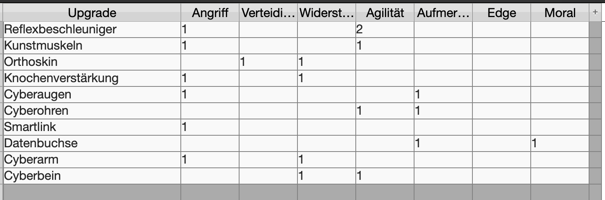

# Ausrüstung

Dieses Dokument behandelt die Ausrüstung (Cyber- und Bioware), die – nach der Überarbeitung von Spieler (`3_Object_Player.md`) und Team (`4_Object_Team.md`) – konkrete Werte erhalten soll. Die Regeln zu Waffen, verbotener Technik und Magie liegen separat in `../ausruestung/ausruestung.md`; hier geht es um die **Werte-Modifikatoren** der Upgrades.

---

## Aktueller Stand

Für die Upgrades wurde eine kurze Liste mit Cyber- und Bioware erstellt (Vorlage: `image.png` in diesem Ordner), die in die Werte-Berechnung einfließen soll:

### Cyberware-Modifikatoren

Transkription der Tabelle aus `image.png` (korrigert per Feedback 25.08.2026, siehe unten):

| Upgrade | Angriff | Verteidigung | Widerstand | Agilität | Aufmerksamkeit | Edge | Moral |
|---|---|---|---|---|---|---|---|
| Reflexbeschleuniger | +1 | – | – | +2 | – | – | – |
| Kunstmuskeln | +1 | – | – | +1 | – | – | – |
| Orthoskin | – | +1 | +1 | – | – | – | – |
| Knochenverstärkung | +1 | – | +1 | – | – | – | – |
| Cyberaugen | +1 | – | – | – | +1 | – | – |
| Cyberohren | – | – | – | +2 | – | – | – |
| Smartlink | +1 | – | – | – | – | – | – |
| Datenbuchse | – | – | – | – | +2 | – | – |
| Cyberarm | +1 | – | +1 | – | – | – | – |
| Cyberbein | – | – | +1 | +1 | – | – | – |

> **Korrekturen 25.08.2026** (aus Abstimmung):
> - **Cyberohren:** Agilität `+1` → `+2`. Der Aufmerksamkeits-Bonus wird nicht zugewiesen (Agilität ist der maßgebliche Wert).
> - **Datenbuchse:** Aufmerksamkeit `+1` → `+2`. Der Moral-Bonus wird nicht zugewiesen (Aufmerksamkeit ist der maßgebliche Wert).
> - **Bioware:** Trombozytenfabrik & Reflexrecorder (SR5-Initiative-Boosts) werden auf **+2 Agilität** abgebildet (OpenBrawl hat kein separates Initiative-Attribut).

### Bioware-Modifikatoren

Ergänzend zur Cyberware-Tabelle werden die beiden Bioware-Implantate aus der typischen Bodytech-Liste (`ausruestung.md` / `1_theorie.md`) mit Werten versehen. Da OpenBrawl unter den 7 Kernwerten (`attack`, `agility`, `defense`, `resistance`, `attention`, `morale`, `edge`) **kein separates Initiative-Attribut** führt, werden die klassischen SR5-Initiative-Boosts auf **Agilität** abgebildet (vgl. Offene Punkte):

| Bioware | Angriff | Verteidigung | Widerstand | Agilität | Aufmerksamkeit | Edge | Moral |
|---|---|---|---|---|---|---|---|
| Trombozytenfabrik | – | – | – | +2 | – | – | – |
| Reflexrecorder | – | – | – | +2 | – | – | – |

---

## Geplante Wirkungsweise

- Die Modifikatoren sollen wie Rassen- und Rollenboni über `ObjectPlayer.effectiveValue(attr)` wirken – also **nur nach unten gekappt** (Minimum 1), nach oben ungekappet (siehe `3_Object_Player.md`, Abschnitt 4 (Attribute).
- **Ausrüstung beeinflusst Marktwert/Preis:** `marketValue` und `price` werden um die aktivierten Cyberware/Bioware-Modifikatoren erhöht (vgl. `3_Object_Player.md`, Abschnitt 5). Die genaue Umrechnungsformel ist noch vorzugeben.

---

## Kosten & Beschränkungen (nach SR5-Standard)

Damit die Upgrades nicht kostenlos sind, gelten SR5-Standard-Regeln (vgl. Shadowrun-5-Regelheft; Scan im Datenordner: `data/Shadowrun 4D - Blut & Spiele (Scan).pdf`):

- **Essenz-Budget = Obergrenze pro Spieler:** Jeder Spieler verfügt über ein Essenzbudget von **6.0** (Mensch; andere Rassen wie im Regelheft). Jedes Implantat verbraucht Essenz; überschreitet man das Budget, werden keine weiteren Upgrades zugelassen. → Das ist die ebenige Obergrenze pro Spieler.
- **Kategorie-Obergrenzen (Überschneidungsregeln):** Pro Körperbereich maximal ein Implantat:
  - **1 × Cyberarm** (pro Arm; zwei Arme = zwei Slots),
  - **1 × Cyberbein** (pro Bein),
  - **1 × Datenbuchse**,
  - **1 × Smartlink**,
  - Orthoskin/Knochenverstärkung sind durch das Essenzbudget limitiert.
- **Availability:** Wie im SR5-Standard (typisch 6–12 für gängige Cyberware).
- **Nuyen-Kosten:** Nach SR5-Standard-Tabelle. Grobe Orientung (bitte gegen Regelheft abgleichen):
  - **Einstieg/Implantate** (Cyberaugen, Datenbuchse, Smartlink): ~1.000–5.000 ¥
  - **Verstärkungen und Gliedmaßen** (Orthoskin, Knochenverstärkung, Kunstmuskeln, Cyberarm/Cyberbein): ~5.000–15.000 ¥
  - **Leistungsfähige Reflex-Boosts** (Reflexbeschleuniger, Reflexrecorder): ~30.000–150.000 ¥

---

## Offene Punkte

| # | Punkt | Status | Bemerkung |
|---|---|---|---|
| 1 | **Cyberohren-Wert** | ✅ | Agilität `+2` (korrigiert; Aufmerksamkeit nicht zugewiesen). |
| 2 | **Datenbuchse-Wert** | ✅ | Aufmerksamkeit `+2` (korrigiert; Moral nicht zugewiesen). |
| 3 | **Bioware-Werte definieren** | ✅ | Trombozytenfabrik und Reflexrecorder auf **+2 Agilität** abgebildet (SR5-Initiative-Boost → Agilität, da kein separates Initiative-Attribut). |
| 4 | **Nuyen-Kosten exakt übernehmen** | 🔶 | SR5-Konventionen übernommen (Essenz 6.0, Kategorie-Limits, Availability, Preisbänder). Die **exakten** ¥-Beträge pro Item werden übernommen, sobald sie aus dem Regelheft (Scan) abgelesen sind. |
| 5 | **Marktwert/Preis-Formel** | 🔶 | Ausrüstung beeinflusst `marketValue`/`price` (beschlossen). Kommt noch. |

---

*Stand: 25.08.2026*
